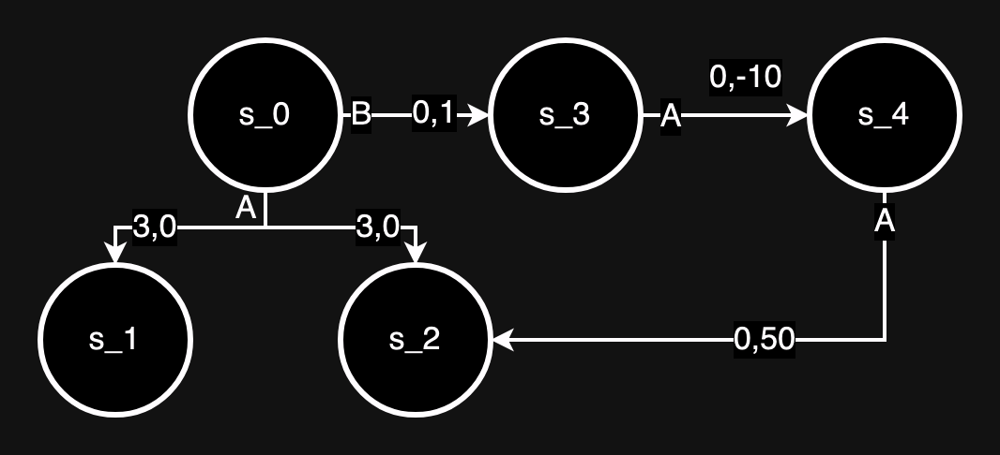
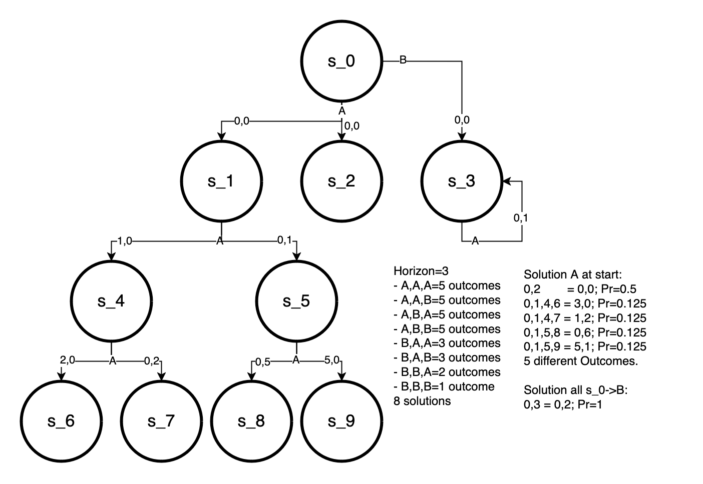

## Test Cases and Evironments

### my_test.json
Two Utilitarian moral theories.
Two undominated policies with worth (1,0) and (0,1).

First policy has one history with worth (1,0) and P=1 -- this is made up of two successors from action A.

Second policy has one history with worth (0,1) and P=1. 
### level_2_prune.json

### level_3_unPrune.json
Building from level_2_prune.json this makes the policy with s_0->B viable by increasing reward from s_4.

### combos.json

