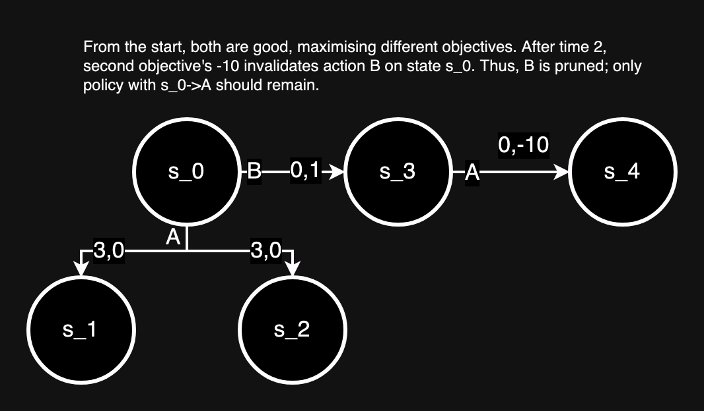
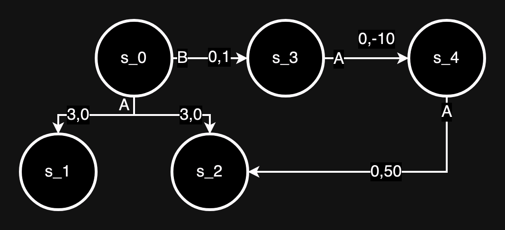
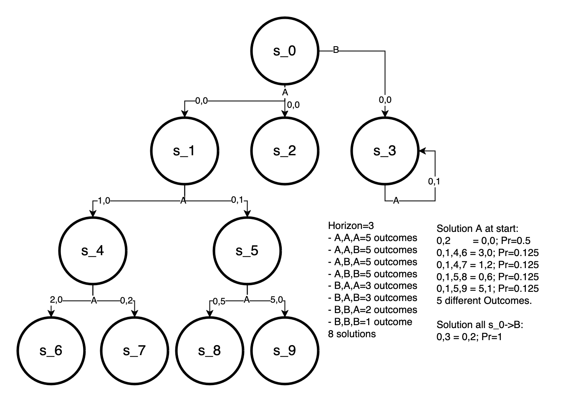

## Test Cases and Evironments

### level_2_prune.json

### level_3_unPrune.json
Building from level_2_prune.json this makes the policy with s_0->B viable by increasing reward from s_4.

### combos.json
